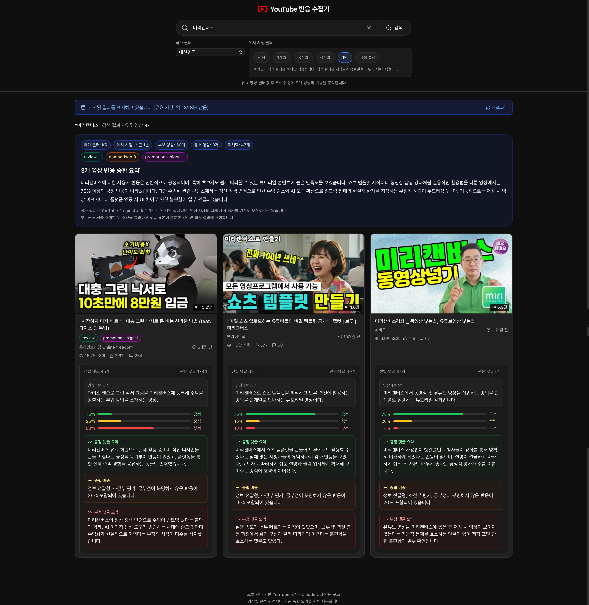

# YouTube 반응 수집기

YouTube 검색어를 기준으로 유효한 영상을 필터링한 뒤 조회수 상위 9개 영상을 선정하고, 댓글 반응을 분석해 영상별 요약과 검색어 기준 종합 요약을 제공하는 React 기반 로컬 웹 앱입니다.

현재 이 저장소의 기본 실행 경로는 `로컬 서버 + YouTube Data API v3 + Claude Code CLI`입니다.

> **이 앱은 독립적으로 기획된 단일 제품이라기보다, `도메인 입력 → 경쟁사/상품 식별 → 공식 홈페이지 기능 비교 → YouTube 사용자 반응 분석 → 인사이트 리포트 생성` 흐름으로 이어지는 인사이트 리포팅 웹 프롬프트를 개발하는 과정에서 분리·구체화된 하나의 컴포넌트 웹 앱입니다.**
>
> 즉, 최종 통합 리포트 생성 과정 중 `YouTube 사용자 반응 분석` 파트를 별도 UI로 게시한 결과물입니다.

## 현재 기능

- 검색어 + 국가 + 게시 연도 필터 입력
- YouTube 검색 결과에서 유효 영상만 선별
- 조회수 상위 9개 영상 선정 및 3x3 카드 표시
- 영상별 댓글 수집 후 품질 점수 기반 선별
- 영상별 분석
  - 긍정/부정 비율
  - 영상 내용 1줄 요약
  - 긍정 댓글 요약
  - 부정 댓글 요약
- 9개 영상 기준 종합 반응 요약
- localStorage 24시간 캐싱
- 빈 결과, 타임아웃, API 오류 처리

## 예시 화면

아래 이미지는 검색 실행 후 유효 영상별 반응 분석과 종합 요약이 함께 표시되는 예시 화면입니다.



## 기술 스택

- Frontend: React 18 + Vite + Tailwind CSS
- Local server: Node.js HTTP server
- Data source: YouTube Data API v3
- Analysis engine: Claude Code CLI
- Cache: localStorage (24시간 TTL)

## 실행 전 요구사항

### Node 버전

`package.json` 기준 지원 버전은 아래와 같습니다.

- `Node.js 20.19.x`
- `Node.js 22.12.x 이상 23 미만`

안정성을 위해 `Node 22 LTS` 사용을 권장합니다.

### Claude CLI 로그인

분석은 로컬 `Claude Code CLI`를 호출하므로 실행 전에 로그인되어 있어야 합니다.

```bash
claude /login
```

PATH에 `claude`가 잡히지 않으면 설치 경로를 직접 지정해야 할 수 있습니다.

## 설치

```bash
npm install
cp .env.example .env
```

## 환경 변수

권장 `.env` 예시는 아래와 같습니다.

```env
SERVER_PORT=4000
SERVER_HOST=127.0.0.1
YOUTUBE_API_KEY=여기에_YouTube_API_키_입력
CLAUDE_CLI_COMMAND=claude
CLAUDE_CLI_TIMEOUT_MS=180000
VITE_API_BASE_URL=http://localhost:4000
```

### 핵심 변수 설명

- `YOUTUBE_API_KEY`: 서버 전용 YouTube API 키
- `CLAUDE_CLI_COMMAND`: Claude CLI 실행 경로. PATH에 없으면 절대경로 권장
- `CLAUDE_CLI_TIMEOUT_MS`: Claude CLI 최대 대기 시간
- `VITE_API_BASE_URL`: 프론트엔드가 호출할 로컬 API 주소

### YouTube API 키 주의사항

YouTube API 키는 `youtube-reaction-app/.env`의 `YOUTUBE_API_KEY`에 넣는 것이 기본입니다.

```env
YOUTUBE_API_KEY=발급받은_YouTube_API_키
```

중요:

- `YOUTUBE_API_KEY`는 서버 전용 변수입니다.
- 기본 실행 기준에서는 `VITE_YOUTUBE_API_KEY` 사용을 권장하지 않습니다.
- `VITE_` 접두사가 붙은 값은 브라우저 빌드에 포함될 수 있으므로 주의해야 합니다.

### Claude CLI 경로 예시

환경마다 설치 경로가 다를 수 있으므로 아래처럼 일반화된 절대경로를 사용할 수 있습니다.

```env
CLAUDE_CLI_COMMAND=/absolute/path/to/claude
```

코드는 아래 순서로 CLI 경로를 탐색합니다.

- `.env`의 `CLAUDE_CLI_COMMAND`
- `$HOME/.local/bin/claude`
- `/opt/homebrew/bin/claude`
- `/usr/local/bin/claude`
- 마지막 fallback으로 `claude`

## 실행 방법

터미널 1:

```bash
npm run dev:server
```

터미널 2:

```bash
npm run dev:client
```

브라우저:

```text
http://localhost:3000
```

참고:

- `npm run dev`는 Vite 클라이언트만 실행합니다.
- 실제 검색/분석까지 하려면 `dev:server`와 `dev:client`를 함께 실행해야 합니다.

## 처리 흐름

1. 사용자가 검색어, 국가, 게시 연도를 입력합니다.
2. 서버가 YouTube 검색 API로 후보 영상을 조회합니다.
3. 유효성 규칙으로 분석 대상 영상을 걸러냅니다.
4. 상위 9개 영상의 댓글을 수집하고 품질 점수 기반으로 선별합니다.
5. 선별 댓글을 Claude CLI에 전달해 영상별 요약을 생성합니다.
6. 9개 영상 결과를 다시 묶어 검색어 기준 종합 요약을 생성합니다.

## 유효 영상 판정 기준

현재 서버는 아래 기준으로 분석 대상을 선별합니다.

- `public` 영상
- embed 가능
- live/upcoming 제외
- 댓글 존재
- 댓글 수 최소 기준 충족
- 길이 90초 이상
- `#shorts` 제외
- 검색어 토큰이 제목/설명에 포함
- 리뷰/비교/설명성 영상 우선
- 광고성 키워드만 강한 `promotional-only` 영상 제외

### 영상 유형 분류 규칙

제목/설명을 기준으로 아래 성격을 추정합니다.

- `review`: 리뷰, 후기, 사용기, 실사용, 장단점 등
- `comparison`: 비교, `vs`, 차이, 대결 등
- `informational`: 설명, 가이드, 뉴스, 분석 등
- `promotional-only`: 광고, 협찬, sponsored, 유료광고 등만 강한 경우

## 댓글 수집 기준

- 최대 5페이지까지 댓글 수집
- 댓글 길이, 검색어 관련성, 좋아요 수 등을 기반으로 점수화
- 분석용 댓글은 최대 180개까지 선별
- 댓글이 지나치게 짧거나 내용성이 낮으면 제외
